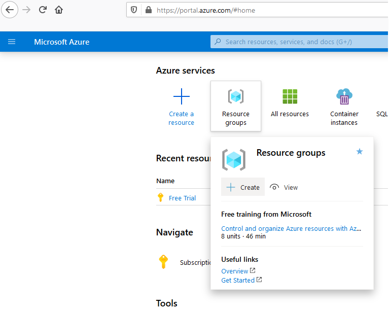
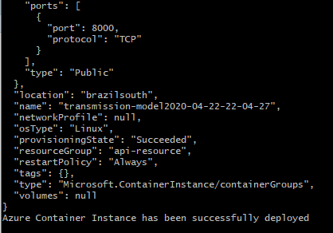
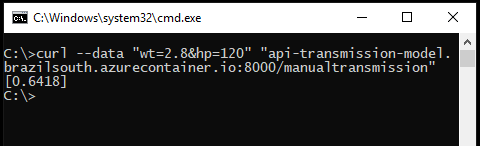

# Objective
Our goal here is to create a R Model and put-in into production by deploying it as web service API using **Docker** to containerize (encapsulate) it and **Microsoft Azure** to host it.


```{r setup, include=FALSE}

knitr::opts_chunk$set(collapse = TRUE, warnings = FALSE, echo = TRUE)

```

# R Model

To create the model, we going to use `mtcars` dataset which one's is present inside R.

```{r}
head(mtcars)
```
The data was extracted from the 1974 Motor Trend US magazine, and comprises fuel consumption and 10 aspects of automobile design and performance for 32 automobiles (1973–74 models).

```{r warning=FALSE, include=FALSE}
Variable = c("mpg", "cyl", "disp", "hp", "drat", "wt", "qsec", "vs", "am", "gear", "carb")
Description = c("Miles/(US) gallon", "Number of cylinders", "Displacement (cu.in.)", "Gross horsepower", "Rear axle ratio", "Weight (1000 lbs)", "1/4 mile time", "Engine (0 = V-shaped, 1 = straight)", "Transmission (0 = automatic, 1 = manual)", "Number of forward gears", "Number of carburetors")

df_var = cbind(Variable, Description)
```

```{r}
df_var
```

### Creating the model

So in our model we going to use a logistic regression model to predict the probability of a vehicle being fitted with a manual transmission based on horsepower (hp) and weight (wt).

```{r}
lr_transmission <- glm(formula = am ~ hp + wt, data = mtcars, family = binomial)
```

Make some prediction with the model.
```{r}
newdata <- data.frame(hp = 120, wt = 2.8)
predict(lr_transmission, newdata, type = "response")
```

As we can see, the probability of a car with 120hp and weigh of 2800lbs being manual is 64.18%.

Now beforehand we need to save our R Model with a default format for future use.

```{r}
saveRDS(lr_transmission, "transmission-model.rds")
```

### Making a model API

To make an API, we going to use the R package `plumber`, this package will transform the R code into a web services common language.

```{r echo=TRUE, comment="%"}
source("api.R", echo = TRUE, keep.source = T, max.deparse.length = 1000)
```

Here at this code above, we define two functions to ours API, one is a classes plot of the target variable, whether a car has manual or automatic transmissions and the other is the function which we going to use to make predections.


To do a brief explanation how this annotations works, the `api.R` file defines two `plumber` “endpoints.” 
One is hosted at the path /plotam and returns an image showing a simple R plot. 

The first part `#*` tells `plumber` that this is a comment of what is this function, the second `@png` is what this functions will return and the third `@get` define the path and the function which will be used.

The other endpoints is hosted at the path /manualtransmission and makes ours predictions.

As in the first endpoint, we have a comment of what is this function, after that we use `@param` to specify the parameters which we going to use (hp and wt) and in the final we use `@post` to set the path and the function that we will use.

In a nutshell, to note some difference between `@get` and `@post`, `@get` will be used to when we ask for data from an API and `@post` when we need to send data to an API. If you want to understand more, at the `plumber` documentation you can see better how this annotations at the` api.R` code properly works.

Ok, now we already have set how ours api will work, let's check how this outputs are on R.
```{r}
plot_am()
model_predict(120, 2.8)
```

The `plumber` part is pretty easy, we need to pass the `api.R` file and which port we going to use. Here we going to use the port 8000.

```{r message=FALSE, warning=FALSE}
library("plumber")
pr <- plumb("api.R")
```

The `pr` object now encapsulates all the logic represented in your `api.R` file. The next step is to bring the API to life using the `run()` method:

```{r eval=F, message=FALSE, warning=FALSE, include=T}
pr$run(port = 8000)
```

Now the API will be running locally in your R session until you press the `ESC` key. In your personal machine, you should be able to open http://localhost:8000/plotam in a web browser to test your new API endpoints.

To see the model endpoint you can use the `curl` command in `terminal` like that:
```{r eval=F, include=T}
$ curl --data "wt=2.8&hp=120" "http://localhost:8000/manualtransmission"
```

# Host the model API

Finally we come to the main and the fun part, deploying the model as an API web service. To do that we going to use **Docker** and **Microsoft Azure**

From this point, we're not going R anymore, insteed that, we going to use the `terminal`.

Make sure your `terminal` can running the `docker` and the `azure CLI` commands and their versions are updated.

You can download those from here.

**Docker**

<https://www.docker.com/products/docker-desktop>

**Azure CLI**

<https://docs.microsoft.com/cli/azure/install-azure-cli>

You also need to create a account on **Microsoft Azure**. You can have a free trial for 30-days on that.

Checking the commands:


### Docker

Docker is a platform that allow you to run processes in an isolated environment, that environment might have certain resources/software pre-configured or may emulate a particular environment.

We will take advantage of the trestletech/plumber Docker image that bundles a recent version of R with the most recent version of plumber pre-installed. You can get this image with these command. 

```{r eval=F}
$ docker pull trestletech/plumber
```

We will start by just running a single Plumber application in Docker just to see things at work. By default, the trestletech/plumber image will take the first argument after the image name as the name of the file that you want to `plumb()` and serve on port `8000`. So right away you can run one of the examples that is included in plumber as it is already installed on the image.

```{r eval=F}
$ docker run --rm -p 8000:8000 trestletech/plumber /usr/local/lib/R/site-library/plumber/examples/04-mean-sum/plumber.R
```

* `docker run` tells Docker to run a new container;
* `--rm` tells Docker to clean-up after the container when it is done;
* `-p 8000:8000` says to map port 8000 from the plumber container (which is where we will run the server) to port 8000 of your local machine;
* `trestletech/plumber` is the name of the image we want to run;
* `/usr/local/lib/R/site-library/plumber/examples/03-mean-sum/plumber.R` is the path inside of the Docker container to the Plumber file you want to host. You will note that you do not need plumber installed on your host machine for this to work, nor does the path /usr/local/... need to exist on your host machine. This references the path inside of the docker container where the R file you want to `plumb()` can be found. This `mean-sum` path is the default path that the image uses if you don’t specify one yourself.

This will ask Plumber to plumb and run the file you specified on port 8000 of that new container. Because you used the `-p` argument, port 8000 of your local machine will be forwarded into your container. You can test this by running this on the machine where Docker is running: `$ curl localhost:8000/mean`. You should get an single number in an array back `[-0.1993]`.

We want to build upon trestletech/plumber image our own Docker image. For that we need to write an Dockerfile. Dockerfiles have a vast array of options and possible configurations, so [see the official](https://docs.docker.com/engine/reference/builder/) docs if you want to learn more about any of these options.


```{r echo=FALSE}
Dockerfile="\n" 
txt = scan("Dockerfile", what = "character", sep = "\n")
for (i in txt) {
  Dockerfile = c(Dockerfile, c(i,"\n"))
}
```

```{r comment=""}
cat(Dockerfile)
```

Those commands works as: 

* `FROM` instruction initializes a new build stage and sets the base image for subsequent instructions;

* `COPY` --from=<name|index> instructions to refer to the image built in this stage. Here we are copying the file from our directory and put in container directory;

* `CMD` it customizes the default argument that will be used when running the image. In this case, you would be expected to mount a Plumber application into the container at /plumber.R

Now we can then build our custom Docker image from this Dockerfile using the command:
```{r eval=F}
$ docker build -t myCustomDocker .
```

Where `.` is the current directory where that Dockerfile is and `myCustomDocker` is where the **Azure** host will enter.

### Azure

Here comes the time to host our API on the web so that anyone can access it. We will need to create and login to an account on **Microsoft Azure**. 

*Note: to create an account on **Microsoft Azure** although the 30-days free trial, is needed a credit card to complete the register.*

To host the API we going to use a script which one can be download [here](https://github.com/andresalerno/data_fintech_solutions/blob/master/scripts/deploying_script.sh). This script was made to run in a windows environment with git bash so if you are in a Linux or MacOS you probably need to edit these `az.cmd` commands to `az`.

In the script we have this parameters to pass:

* `subscriptionId` is related to azure account;
* `resourceGroupName` is the name of the resource group which we going to host the API
* `resourceGroupLocation` is the region where the resource group is - only needed if the resource group isn't already created;
* `aciDnsNameLabel` the first part of the web service link;
* `acrName` the name of the azure container registry. This where we going to substitute in the `myCustomDocker`.

The two last ones parameters we can set in the `define` part of the code, or in the script running.

The two first ones also could be set in the `define` part of the code, or in the script running but is better to set these in the define part because is also better create the `RESOUCE GROUP` beforehand.

So to make our life easier we going to login into https://portal.azure.com/#home to create a `RESOUCE GROUP`.

After login, to create that we need to go here:


Set the name and the region which we want - this name will be used in `resourceGroupName`


And finally we get this.


The number which appers in **Subscription ID** it is the number we are going to use in `subscriptionId`.

Now we going to run the script. Make sure all .R file, the Dockerfile and the script are in the same directory. If the script works properly we going to see this at final:




And the red links is our API web service !

On the web browser we can check the /plotam service on:

http://api-transmission-model.brazilsouth.azurecontainer.io:8000/plotam 

Now to make predictions using our API we can use this command at `terminal` (wherever you are):
```{r eval=F}
$ curl --data "wt=2.8&hp=120" "api-transmission-model.brazilsouth.azurecontainer.io:8000/manualtransmission"
```

And you should get this:



# Conclusions

We built a simple model API with R `plumber` package, containerized it with **Docker**, and deployed it to the web with **Microsoft Azure**. This makes ours models more collaborating with other developers and much more accessible. They only need to learn how to use your API to integrate your model into their applications and systems.


